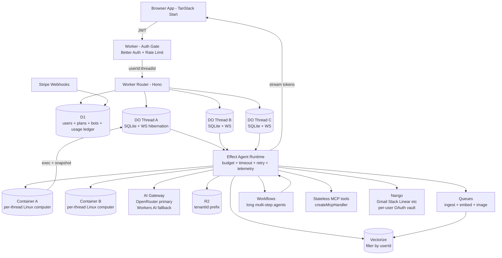

# Open Agent Stack - Architecture Blueprint

Date: 2026-10-08
Owner: cman
Goal: Grok-bot / ChatGPT-GPT style product where users get a fast chat UI plus a real Linux computer per thread where agents can work.

This file is context for another agent to spec and build from. It captures architecture, tech stack decisions, and open source install method.

## 1. Product Shape

- Multi-user SaaS, not single user demo
- 1 user has many threads, 1 thread has 1 chat + 1 computer
- Chat feels instant: stream tokens, optimistic send, instant thread switch
- Computer feels real: shell, files, installs, previews, persists across sessions
- Agents run tools via MCP without forcing users to re-OAuth every time

Non-goals for MVP:
- No full virtualized desktop streaming
- No GPU training inside sandbox
- No enterprise SSO / SCIM on day one

## 2. Architecture

Request path:
1. Browser sends message with JWT
2. Auth Worker verifies, rate checks, routes to DO by `userId:threadId`
3. DO loads hot state from SQLite, calls Effect runtime
4. Effect checks budget, calls model via Gateway, calls tools via MCP / Nango, uses Container for shell / files
5. Tokens stream back over hibernated WebSocket, partial state saved for resume
6. Usage written to D1 ledger, files to R2, memory to Vectorize

Brain vs hands pattern:
- Brain in DO: identity, state, policy, lifecycle, chat
- Hands in Container: Linux workspace that can sleep and snapshot
- Follows Anthropic decoupled pattern and Cloudflare DO + Container model

## 2b. Shared Computer Mode Toggle

Default is isolated. Shared is opt in per team.

- Isolated: 1 thread equals 1 DO plus 1 Container from personal snapshot. Strongest boundary.
- Shared: N threads attach to 1 team Container. Auth once, files and browser shared, bots pass work.

Why this is easy here: DO holds agent state in SQLite either way. Toggle only swaps which Container the DO execs into.

- Mode field: `computerMode: isolated | shared:teamComputerId` on team or thread
- Isolated path: DO calls ctx.container.start with personal image and snapshot
- Shared path: DO attaches to shared Container ID with exec session, no new boot
- Shared rules: one writer lock per path, queue others, snapshot before shared run, per actor activity log, Nango tokens scoped to user with usage audit
- Kill switch: eject thread back to isolated from last clean snapshot
- UI default: isolated. Shared shows explicit warning about shared files and shared auth.

Grok parity note: Grok Bot shares one user scoped computer across named bots with single perimeter. Our default is stronger per thread isolation. Shared mode matches Grok team behavior when user wants it.

## 3. Tech Stack Decision

Lean heavy on Cloudflare primitives. No Postgres, Redis, or Kubernetes to operate.

Edge and compute:
- Cloudflare Workers for API and routing
- Cloudflare Durable Objects with SQLite for per-thread state and WS hibernation
- Cloudflare Containers with durable_object scheduling for per-thread computer
- Cloudflare Sandbox SDK for exec, snapshots, sleep and resume
- Cloudflare Workflows for runs over 30s
- Cloudflare Queues for ingest and background jobs

Agent runtime:
- Effect from https://effect.website for agent loop
- Packages: effect, @effect/schema, @effect/platform, @effect/ai
- Use Effect only in agent runtime at first, not whole API
- Each tool as Effect.Service with Schema in and out
- Main loop as Effect.gen with timeout, retry Schedule, concurrency cap
- Layers per thread: Db, Gateway, Tools, Telemetry

Models:
- OpenRouter via AI Gateway Universal Endpoint as primary
- Workers AI as fallback
- Headers required for OpenRouter: Authorization Bearer, HTTP-Referer app URL, X-Title bot name
- Tag with user_id and sessionId for cost tracking
- Vercel AI SDK on client for token streaming

Data:
- D1: users, plans, bots, threads, usage ledger
- Vectorize: memory, namespaced and filtered by userId
- R2: files and snapshots, prefix `tenantId/`, signed URLs
- DO SQLite: hot thread state, task list, pending timers
- Container snapshot: workspace with repo, deps, build cache

Auth and identity for speed now:
- Better Auth in D1 for login, orgs, API keys
- Self hosted in our DB, we control it
- Upgrade path only: Zitadel self host for B2B orgs fast, or Ory Hydra plus Kratos for headless Apache-2.0 ownership
- Deferred: Keycloak for SAML and LDAP depth, Authentik and Authelia for internal proxy use

Tools and MCP:
- Own tools as stateless Worker with createMcpHandler, MCP 2026-07-28
- workers-oauth-provider to protect own MCP with OAuth 2.1, DCR, PKCE
- Nango Connect plus Nango MCP for third party SaaS so users auth once
- DO stores only connectionId, Nango holds refresh tokens server side
- Curate under 20 tools per turn, use tool search for rest

Frontend for stupid fast feel:
- TanStack Start on Pages plus TanStack Router plus Query plus oRPC plus Drizzle plus Hono
- shadcn plus Tailwind for UI
- Static shell on edge, chat as streaming client
- Tactics: WS streaming with chunked render, virtualized list, optimistic send, prefetch on hover, Query cache, React Compiler on, memo message rows, font subset, icon sprite
- Defer until slow: service worker shell cache, bundle split audit, SPA vs SSR switch

Ops:
- Stripe webhooks to D1 for plan updates
- AI Gateway for cache, fallback, logging
- Workers Logs plus Tail plus Sentry for Effect defects
- Analytics for tokens per user, per model, per tool

Why this stack:
- Zero cold start for chat path, 648ms median for computer start with new scheduling
- Hibernation means idle threads cost zero CPU
- Active CPU billing wins because agents idle 71 to 98 percent waiting on LLM
- One vendor bill, one deploy, edge close to user

Alternatives considered and rejected for MVP:
- boxd.sh: real KVM per agent with own kernel, root, systemd, Docker, persistent. Great isolation and EU plus self host. Rejected to stay Cloudflare native, keep as fallback if Docker in VM becomes hard requirement. See https://boxd.sh/use-cases/agent-sandboxes
- E2B Firecracker: strongest isolation for adversarial code, $0.0504 per vCPU hr. Rejected for now to avoid second vendor.
- Daytona: sub 90ms create, same low rates, $200 credit, fully open self host. Best fallback for cheap plus self host.
- Modal gVisor: higher rates near $0.071 per vCPU hr, best only if already on Modal for inference.

## 4. Open Source Install Method

Goal: anyone can clone repo and run on their own Cloudflare account with their own keys.

Primary CLI: `cf`, the new Cloudflare agentic CLI in beta. It covers full API plus Workers projects with typed `cloudflare.config.ts`. See https://developers.cloudflare.com/cf/ and https://blog.cloudflare.com/cloudflare-cf-cli-launch/

Wrangler compat: `cf` resource commands can run alongside Wrangler project without change. Run `cf migrate` before `cf dev`, `cf build`, `cf deploy` in old project.

What user brings:
- CLOUDFLARE_API_TOKEN
- CLOUDFLARE_ACCOUNT_ID
- OPENROUTER_API_KEY
- Optional: NANGO_KEY, STRIPE keys, BETTER_AUTH_SECRET

Repo shape:
- apps/web: TanStack Start UI
- workers/api: Hono plus Effect agent runtime
- workers/sandbox-do: DO plus Container controller with ctx.container.start
- mcp: stateless tools with createMcpHandler
- infra: cloudflare.config.ts per env with bindings.text, bindings.secret, bindings.kv, bindings.d1, bindings.r2, bindings.queue, bindings.ai, bindings.vectorize
- scripts/setup.ts: one command installer using cf
- .env.example: names only, no values
- PROMPT.md: copy paste prompt for AI CLI to provision and deploy

Onboarding:
1. git clone plus bun i
2. cf login
3. bunx our-app init: prompts for keys, creates D1, R2, KV, Queues, Vectorize, AI Gateway, Container images, writes .dev.vars
4. bun run dev for local with simulated bindings, remote bindings optional for prod data
5. cf deploy for prod

Bindings model from docs: bindings are permission plus API, no secret in code, accessed via env. See https://developers.cloudflare.com/workers/runtime-apis/bindings/

Containers model from docs: durable_object policy lets code pick image and instance at runtime, supports cloudflare/debian-trixie without Dockerfile, plus snapshot save and restore. See https://developers.cloudflare.com/containers/configuration/scheduling-policy/ and https://blog.cloudflare.com/faster-agent-sandboxes/

License to decide: MIT or Apache-2.0 for max cloning, AGPL-3.0 if hosted forks must share back.

## 5. Context For Next Agent

Build order for MVP:
1. Auth plus thread CRUD plus D1 ledger
2. DO chat with OpenRouter streaming via Gateway
3. Container start, exec, snapshot, restore per thread
4. Nango Connect for first 3 integrations, store connectionId in D1
5. Own MCP tools behind workers-oauth-provider
6. Usage caps, rate limits, Stripe basic
7. Speed pass: virtual list, prefetch, optimistic UI

Env vars to define:
- OPENROUTER_API_KEY, AI_GATEWAY_ID
- BETTER_AUTH_SECRET, DATABASE_URL D1 binding name
- NANGO_SECRET_KEY, NANGO_MCP_URL
- R2_BUCKET, VECTORIZE_INDEX, QUEUE_NAME
- CONTAINER_IMAGE_MAP, DEFAULT_INSTANCE standard-2

Bindings to define in cloudflare.config.ts:
- d1 DATABASE, r2 UPLOADS, kv CACHE, queue JOBS, ai AI, vectorize SEARCH_INDEX
- durable object AGENT_COMPUTER with sqlite storage
- containers app with scheduling_policy durable_object
- secrets: OPENROUTER_API_KEY, BETTER_AUTH_SECRET, NANGO_KEY
- triggers: fetch pattern, scheduled for automations, queue consumer

Open questions:
- Session shape: ephemeral 5 min task vs persistent days long computer. Default to persistent snapshot per thread.
- First 3 integrations: suggest Gmail, Slack, Linear. Confirm before building Nango schemas.
- Snapshot retention and R2 cost cap per user.
- Per user caps: max threads, tokens per day, tool calls per hour, container hours.
- License final pick.
- cf version pin for reproducible setup.

Metrics to add now:
- Time to interactive shell, time to first token, thread switch ms
- Container start ms, snapshot save and restore ms
- Tokens per user and per tool, 429 rate from OpenRouter

Docs to read next:
- https://developers.cloudflare.com/cf/
- https://developers.cloudflare.com/workers/runtime-apis/bindings/
- https://developers.cloudflare.com/containers/configuration/scheduling-policy/
- https://blog.cloudflare.com/faster-agent-sandboxes/
- https://blog.cloudflare.com/mcp-v2/
- https://github.com/cloudflare/workers-oauth-provider
- https://effect.website/
